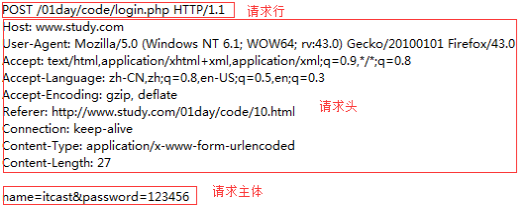
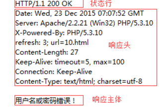
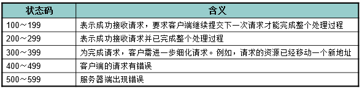
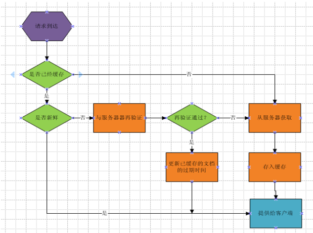

# HTTP协议
即超文本传输协议，网站是基于HTTP协议的，例如网站的图片、CSS、JS等都是基于HTTP协议进行传输的。

HTTP协议是由从客户机到服务器的 **请求(Request)** 和从服务器到客户机的 **响应(Response)** 进行了约束和规范。

即HTTP协议主要由**请求**和**响应**构成。

常用请求方法 **POST**、**GET**、PUT、DELETE

## 请求/请求报文
请求由客户端发起，其规范格式为：**请求行**、**请求头**、**请求主体**。



1. 请求行

由请求方式、请求URL和协议版本构成

2. 请求头

* Host：localhost请求的主机
* Cache-Control：max-age=0控制缓存
* Accept：*/* 接受的文档MIME类型
* User-Agent：**很重要**
* Referer：从哪个URL跳转过来的
* Accept-Encoding：可接受的压缩格式
* If-None-Match：**记录服务器响应的ETag值，用于控制缓存此值是由服务器自动生成的**
* If-Modified-Since：**记录服务器响应的Last-Modified值此值是由服务器自动生成的**

3. 请求主体

即传递给服务端的数据

**注：当以post形式提交表单的时候，请求头里会设置**
**Content-Type: application/x-www-form-urlencoded，以get形式当不需要**

## 响应/响应报文

响应由服务器发出，其规范格式为：**状态行、响应头、响应主体**。



1. 状态行

由协议版本号、状态码和状态信息构成

2. 响应头

* Date：响应时间
* Server：服务器信息
* Last-Modified：资源最后修改时间
* 由服务器自动生成
* ETag：资源修改后生成的唯一标识
* 由服务器自动生成
* Content-Length：响应主体长度
* Content-Type：响应资源的MIME类型

**MIME是标识文件类型的，文件后缀并不能正确无误的标识文件的类型。**

3. 响应主体
即服务端返回给客户端的内容；

**状态码**



**常见的有200代表成功、304文档未修改、403没有权限、404未找到、500服务器错误**

# 协商缓存（性能优化）

[前端优化雅虎35条](http://www.tuicool.com/articles/J3uyaa)  [重绘&回流](http://www.zhangxinxu.com/wordpress/2010/01/%E5%9B%9E%E6%B5%81%E4%B8%8E%E9%87%8D%E7%BB%98%EF%BC%9Acss%E6%80%A7%E8%83%BD%E8%AE%A9javascript%E5%8F%98%E6%85%A2%EF%BC%9F/)

利用浏览器的缓存机制，可以有效的减少HTTP的请求，提高页面加载速度，增强用户体验，同时也能极大的减轻服务器的负担，结合HTTP协议，**缓存协商就是根据HTTP协议实现缓存控制的一种机制。**

问题：是否见过某些网站CSS地址后面会带有一些参数，通常为xxx.css?cache=20160106形式
这种做法是用来强制清除缓存的，实际开发过程中，每当新功能上线时最容易引起BUG的即CSS的缓存，但是浏览器的缓存能减少请求，如果每次都强制清除，会对性能有损失，所以控制浏览器缓存成为前端性能化的一个重点

1. Last-Modified时间精确到了秒，但如果1秒内修改了多次，并不能精确的更新缓存。
2. ETag则是判断文件内容任何改变后，便会由服务器自动生成一个唯一标识。 
3. Expires 过期时间，HTTP1.0的规范，一个绝对的时间
4. Cache-Control HTTP1.1规范，设置过期时间，优先级高于Expires。



# AJAX编程

即 Asynchronous Javascript And XML，AJAX 不是一门的新的语言，而是对现有持术的综合利用。
**本质是在HTTP协议的基础上以异步的方式与服务器进行通信。**

## XMLHttpRequest

浏览器内建对象，用于在后台与服务器通信(交换数据) ，由此我们便可实现对网页的部分更新，而不是刷新整个页面。

``` javascript
// 实例化
var xhr = new XMLHttpRequest();

// 发起一个http请求
xhr.open('get','index.php');
xhr.send(null);

//接受服务器响应
xhr.onreadystatechange = function () {
    if(xhr.readyState == 4 && xhr.status == 200) {
        var result = document.querySelector('.result');
        result.innerHTML = xhr.responseText;
    }
}
```
由于XMLHttpRequest本质基于HTTP协议实现通信，所以结合HTTP协议和上面的例子我们分析得出如下结果：

## 请求

1. 请求行
``` javascript
xhr.open('get','index.php');
```
2. 请求头
``` javascript
xhr.setRequestHeader('Content-Type','text/html')
// get 请求可以不设置
```
3. 请求主体
``` javascript
xhr.send(null)
```
## 响应

HTTP响应是由服务端发出的，作为客户端更应关心的是响应的结果。

HTTP响应3个组成部分与XMLHttpRequest方法或属性的对应关系。

**由于服务器做出响应需要时间（比如网速慢等原因），所以我们需要监听服务器响应的状态，然后才能进行处理。**
``` javascript

//接受服务器响应
xhr.onreadystatechange = function () {
    if(xhr.readyState == 4 && xhr.status == 200) {
        var result = document.querySelector('.result');
        result.innerHTML = xhr.responseText;
    }
}
```
**onreadystatechange是Javascript的事件的一种，其意义在于监听XMLHttpRequest的状态**

1. 获取状态行（包括状态码&状态信息）
``` javascript
xhr.status//状态码
xhr.statusText//状态信息
```
2. 获取响应头
``` javascript
//获取指定头信息
xhr.getResponseHeader('Content-Type');
xhr.getAllResponseHeader();
```
3. 响应主体
``` javascript
xhr.responseText;
xhr.responseXML;
```
## API详解

* xhr.open() 发起请求，可以是get、post方式
* xhr.setRequestHeader() 设置请求头
* xhr.send() 发送请求主体get方式使用xhr.send(null)
* xhr.onreadystatechange = function () {} 监听响应状态
* xhr.readyState = 0时，UNSENT open尚未调用
* xhr.readyState = 1时，OPENED open已调用
* xhr.readyState = 2时，HEADERS_RECEIVED 接收到头信息
* xhr.readyState = 3时，LOADING 接收到响应主体
* xhr.readyState = 4时，DONE 响应完成不用记忆状态，只需要了解有状态变化这个概念
* xhr.status表示响应码，如200
* xhr.statusText表示响应信息，如OK
* xhr.getAllResponseHeaders() 获取全部响应头信息
* xhr.getResponseHeader('key') 获取指定头信息
* xhr.responseText、xhr.responseXML都表示响应主体

**注：GET和POST请求方式的差异（面试题）**
1. GET没有请求主体，使用xhr.send(null)
2. GET可以通过在请求URL上添加请求参数
3. POST可以通过xhr.send('name=itcast&age=10')
4. POST需要设置
``` javascript
xhr.setRequestHeader('Content-Type','application/x-www-form-urlencoded');
```    
5. GET效率更好（应用多）
6. GET大小限制约4K，POST则没有限制问题？如何获取复杂数据呢？

# 封装AJAX工具函数
为了提升我们的开发效率，我们自已将XMLHttpRequest封装成一个函数。
``` javascript
    // 封装ajax工具函数
    // 声明那些变量
    // 1.请求方式  type
    // 2.请求地址  url
    // 3.请求正文  data
    // 4.成功回调  success
// 问题:1.传参不够灵活  2.必须按照顺序传
// 问题：2如何解决ajax工具函数覆盖的问题，解决方案:命名空间
        


// name=itcast&age=10
        var $={
            // 把对象转换成http协议请求正文的格式
            param:function(obj){
                var str="";
                for(var k in obj){
                    str+=k+"="+obj[k]+"&";
                }
                str=str.slice(0,-1);
                return str;
            },
            ajax:function(options){
                // 1.声明请求方式
                var type=options.type||'get';
                // 2.声明请求地址
                var url=options.url||'';
                // 3.声明请求正文
                // var obj={
                    // name:'itcast',
                    // age:18
                // }
                var data=this.param(options.data||'');
                // 4.成功时的回调
                var success=options.success;

                // 1.实例化对象
                var xhr=new XMLHttpRequest();

                // 2.请求行
                if(type=='get'){
                    url=url+'?'+data;
                    data=null;
                }
                xhr.open(type,url);
                // 3.请求头
                if(type=='post'){
                    xhr.setRequestHeader('Content-Type','application/x-www-form-urlencoded');
                }
                // 4.请求正文
                xhr.send(data);
                // 5.监听
                xhr.onreadystatechange=function(){
                    if(xhr.readyState==4&&xhr.status==200){
                        var result=xhr.responseText;
                        success(result);
                    }
                }
            }
        }
        var obj={
            name:'itcast',
            age:10
        }
        $.ajax({
            type:'get',
            url:'1-ajaxTools.php',
            data:obj,
            success:function(data){
                console.log(data);
            }
        })
```
# jQuery中的Ajax

jQuery为我们提供了更强大的Ajax封装

$.ajax({}) 可配置方式发起Ajax请求

$.get() 以GET方式发起Ajax请求

$.post() 以POST方式发起Ajax请求

$('form').serialize() 序列化表单（即格式化key=val&key=val）

url 接口地址

type 请求方式

timeout 请求超时

dataType 服务器返回格式

data 发送请求数据

beforeSend: function () {} 请求发起前调用

success 成功响应后调用

error 错误响应时调用

complete 响应完成时调用（包括成功和失败）

``` javascript
       $.ajax({
           type:'post',
           url:'stars.php',
           data:null,
           timeout:1000,
        //    dataType:期望服务器给我们发送什么类型的文件  html  text  json  xml 
        //    dataType:jsonp 跨域的方案  让ajax方法以get请求的方式进行跨域
           dataType:
           beforeSend:function(){
               console.log('请求发起前');
           },
           success:function(result){
               var arr=JSON.parse(result);
               console.log(arr);
            //    console.log(result);
            var html='';
            for(var i=0;i<arr.length;i++){
                html+=
                        '<tr>'+
                            '<td>'+arr[i].name+'</td>'+
                            '<td>'+arr[i].photo+'</td>'+
                            '<td>'+arr[i].ablum+'</td>'+
                             '<td>'+arr[i].age+'</td>'+
                              '<td>'+arr[i].sex+'</td>'+
                        '</tr>';
            }
            // console.log(html);
            $('table').html(html);
           },
           error:function(error){
               console.log('--------------')
               console.log(error);
               console.log('--------------')
           },
           complete:function(){
               console.log('请求完成(无论请求成功还是失败都会触发)')
           }
       })
```
# JSON

**即 JavaScript Object Notation，另一种轻量级的文本数据交换格式，独立于语言。**
## 语法规则
1. 数据在名称/值对中
2. 数据由逗号分隔(最后一个健/值对不能带逗号)
3. 大括号保存对象方括号保存数组
4. 使用双引号                                                                

## JSON解析
* JSON.parse()
* JSON.stringify()

**总结：JSON体积小、解析方便且高效，在实际开发成为首选。**

# JSONP
``` javascript
// var bar = function(data) {
    console.log(data);
// }
// <script src="test1?callback=bar"></script>
var foo = function(data) {
    console.log(data);
}

var s=document.createElement('script');
s.src = "test?"callback=foo";
document.body.appendchild(s);
```

